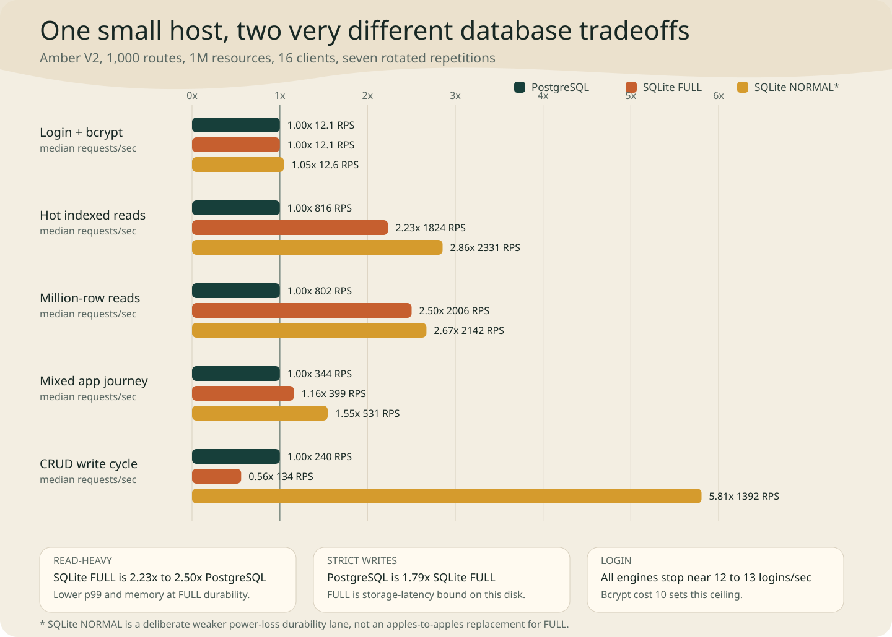

# Amber V2 same-host database benchmark

## The short answer

On a one-vCPU, 512 MB application host, **SQLite is the better read-heavy
single-node database and PostgreSQL is the better strictly durable write-heavy
database**.

- SQLite `synchronous=FULL` delivered **2.23x** PostgreSQL throughput on hot
  indexed reads and **2.50x** on reads spread across one million records.
- PostgreSQL delivered **1.79x** SQLite FULL throughput on a create/read/update/
  delete cycle. SQLite FULL spent a median **66.5%** of target time in I/O wait.
- SQLite `synchronous=NORMAL` was the fastest lane, including **5.81x**
  PostgreSQL CRUD throughput, but it is deliberately not the same power-loss
  durability promise as PostgreSQL or SQLite FULL.
- Login stopped at **12-13 requests/sec for every database**. Bcrypt cost 10,
  not the router or database, is the limit on this one-vCPU host.
- All **105** stock-Crystal steady-state trials, **12** `acrystal` confirmation
  trials, and **6** cold-cache trials completed with zero socket, HTTP,
  application, or swap errors.



This experiment uses the optimized Amber V2 router, but it does **not** compare
Amber 1.4 to V2 or isolate old-router versus new-router gains. It answers the
database deployment question while keeping the Amber V2 application fixed.

## What was tested

The target was a DigitalOcean `s-1vcpu-512mb-10gb` droplet with one reported
CPU, 458 MiB usable RAM, and no swap during measurement. A separate `c-4` load
generator sent HTTP/1.1 traffic over the private VPC. No TLS, reverse proxy, or
external network latency was included.

The same release-built Amber application and Grant models were used for every
lane:

- 1,000 registered Amber routes.
- 10,000 users and 1,000,000 resources.
- 240-byte resource bodies plus title, status, score, version, owner, UUID,
  ULID, and timestamps.
- Integer primary-key, UUID, ULID, and `(user_id, id DESC)` owner-list indexes.
- Every authenticated request hashes its bearer token with SHA-256 and loads
  the database session.
- Login performs an indexed email lookup, bcrypt cost-10 verification, secure
  token generation, SHA-256 storage, and a session insert.
- An eight-connection Grant/crystal-db pool. Requests above the pool size wait
  rather than fail.

Both query planners confirmed indexed access for integer, UUID, ULID, and owner
lookups. The captured plans are in
[`round23_database_index_plans.txt`](results/round23_database_index_plans.txt).

The hot and broad read mixes are 45% integer ID, 20% UUID, 15% ULID, and 20%
owner-list requests. Hot reads keep 70% of lookups in the first 200,000 rows;
broad reads traverse the full million-row key space. The mixed journey adds 2%
login, 8% calculation, 6% resource updates, and 4% full CRUD cycles.

## Steady-state results

These are medians from seven rotated process repetitions at 16 connections,
with six seconds of warmup and twelve measured seconds per trial.

| Workload | PostgreSQL RPS | SQLite FULL RPS | FULL vs PG | SQLite NORMAL RPS | NORMAL vs PG |
| --- | ---: | ---: | ---: | ---: | ---: |
| Login + bcrypt | 12.07 | 12.07 | 1.00x | 12.65 | 1.05x |
| Hot indexed reads | 816 | 1,824 | **2.23x** | 2,331 | **2.86x** |
| Million-row reads | 802 | 2,006 | **2.50x** | 2,142 | **2.67x** |
| Mixed app journey | 344 | 399 | **1.16x** | 531 | **1.55x** |
| CRUD write cycle | 240 | 134 | **0.56x** | 1,392 | **5.81x** |

SQLite's read advantage also appears in tail latency and memory:

| Workload | PostgreSQL p99 / memory | SQLite FULL p99 / memory | SQLite NORMAL p99 / memory |
| --- | ---: | ---: | ---: |
| Hot indexed reads | 217 ms / 164.5 MiB | 32 ms / 100.3 MiB | 21 ms / 37.1 MiB |
| Million-row reads | 217 ms / 163.9 MiB | 25 ms / 61.3 MiB | 25 ms / 30.3 MiB |
| Mixed app journey | 847 ms / 75.2 MiB | 1,100 ms / 27.9 MiB | 966 ms / 28.1 MiB |
| CRUD write cycle | 257 ms / 68.7 MiB | 249 ms / 22.0 MiB | 27 ms / 57.1 MiB |

Memory is the application plus the PostgreSQL service when applicable, as
reported by systemd cgroup accounting. It includes cache charged to those
cgroups, so it should be interpreted as host pressure rather than only live
Crystal objects.

The write result is a durability result, not a contradiction:

| CRUD median | Target CPU | I/O wait | Disk utilization | Disk writes / 12 s |
| --- | ---: | ---: | ---: | ---: |
| PostgreSQL | 91.8% | 3.7% | 51.7% | 27.9 MiB |
| SQLite FULL | 27.8% | **66.5%** | **77.1%** | 59.6 MiB |
| SQLite NORMAL | 88.5% | 7.2% | 9.3% | 198.5 MiB |

SQLite FULL waits for durable storage on each transaction. PostgreSQL can do
more CPU work and group durable WAL activity across concurrent clients. SQLite
NORMAL removes most of that waiting, but the application must explicitly
accept its weaker loss window after an OS crash or power failure.

## Calibration and cold cache

The one-pass calibration selected 16 connections because it was SQLite FULL's
peak and the last point before both engines declined:

| Connections | PostgreSQL hot-read RPS | SQLite FULL hot-read RPS |
| ---: | ---: | ---: |
| 4 | 674 | 1,340 |
| 8 | 827 | 1,900 |
| 16 | **862** | **2,225** |
| 32 | 775 | 2,101 |

The separate cold-cache control restarted PostgreSQL, closed SQLite's setup
process, dropped the OS page cache, skipped warmup, and used three rotated
eight-second broad-read trials:

| Cold million-row read | Median RPS | p50 | p99 | Combined memory | Disk read / trial |
| --- | ---: | ---: | ---: | ---: | ---: |
| PostgreSQL | 593 | 15.9 ms | 233 ms | 156.2 MiB | 46.7 MiB |
| SQLite FULL | **1,190** | **9.3 ms** | **46 ms** | **79.8 MiB** | 52.1 MiB |

SQLite FULL retained a **2.01x** cold-start advantage. This means its warm
result is not only an accidental page-cache win.

## Disk and data footprint

The target's ten-second direct-I/O probe used 4 KiB blocks, queue depth 16, and
a 70/30 random read/write mix:

| Direction | IOPS | Throughput | p50 completion | p99 completion |
| --- | ---: | ---: | ---: | ---: |
| Read | 24,335 | 99.7 MB/s | 0.403 ms | 1.696 ms |
| Write | 10,442 | 42.8 MB/s | 0.338 ms | 1.761 ms |

PostgreSQL occupied 585.8 MiB and SQLite occupied 460.7 MiB after the identical
million-row seed. The final seed took 30.92 seconds for PostgreSQL and 27.25
seconds for SQLite. SQLite reported `integrity_check = ok`.

## Compiler compatibility

The database application type-checked in all four combinations:

- Homebrew Crystal 1.20.3 with PostgreSQL and SQLite.
- `acrystal` 1.20.0-dev `[6636853e8]` with PostgreSQL and SQLite.

The behavior suite passed on both compilers with four examples and zero
failures. The hosted fork confirmation then completed 12 trials with zero
errors:

| Fork lane | PostgreSQL | SQLite FULL | SQLite vs PG |
| --- | ---: | ---: | ---: |
| Hot indexed read | 808 RPS | 1,782 RPS | 2.21x |
| Mixed journey | 383 RPS | 399 RPS | 1.04x |

Those reduced fork trials prove runtime compatibility, not a compiler speed
claim. They used three eight-second repetitions rather than the stock lane's
seven twelve-second repetitions. The stock and fork binaries share the same
Amber source, Grant source, schemas, release flags, Linux target, and linker.

## Recommendation

Use **SQLite FULL** for a single Amber process when the workload is read-heavy,
the data lives with the application, and keeping memory/cost low matters. It is
the clear winner for the common indexed CRUD-read shape on this host.

Use **PostgreSQL** when strictly durable writes are frequent, multiple app
instances need concurrent database access, or replication/operations matter.
On this disk it is nearly twice as fast as SQLite FULL for the durable CRUD
cycle despite the extra process.

Treat **SQLite NORMAL** as an explicit performance mode for data that can
tolerate its documented crash window. Its numbers are excellent, but labeling
them simply as "SQLite is faster" would hide the most important tradeoff.

For login-heavy systems, changing databases is not the next optimization.
Preserve the password-hash security cost and investigate bounded hash workers,
admission control, and larger CPU shapes so bcrypt cannot monopolize request
execution.

## Reproduction and evidence

The benchmark source is checkpointed on
`experiment/framework-database-round23`. The release server binaries were built
from `4952079`; the final steady-state runner and timeout contract were at
`bbf62d6`. The current branch contains later reporting and cold-cache support.

Primary evidence:

- [`round23_digitalocean_database_matrix.json`](results/round23_digitalocean_database_matrix.json): 105 steady-state trials and aggregates.
- [`round23_digitalocean_database_calibration.json`](results/round23_digitalocean_database_calibration.json): concurrency selection.
- [`round23_digitalocean_database_cold_cache.json`](results/round23_digitalocean_database_cold_cache.json): cold-cache control.
- [`round23_digitalocean_database_acrystal_confirmation.json`](results/round23_digitalocean_database_acrystal_confirmation.json): hosted fork compatibility.
- [`round23_do_database_seed_manifest.json`](results/round23_do_database_seed_manifest.json): row counts, sizes, and bcrypt cost.
- [`round23_do_binaries_manifest.json`](results/round23_do_binaries_manifest.json): linked Linux binary hashes and libraries.
- [`round23_do_objects_manifest.json`](results/round23_do_objects_manifest.json): source commit, compiler versions, target, and cross-compiled object hashes.
- [`round23_digitalocean_disk_probe_summary.json`](results/round23_digitalocean_disk_probe_summary.json): direct-I/O result.
- [`round23_postgres_seed.time.txt`](results/round23_postgres_seed.time.txt) and [`round23_sqlite_seed.time.txt`](results/round23_sqlite_seed.time.txt): seed resource evidence.

Verify every committed trial count, error/swap invariant, seed count, compiler
lane, and headline performance ordering with:

```shell
ruby benchmarks/bin/verify_database_round23_results.rb
```

Recreate the lab with:

```shell
APPLY=1 benchmarks/digitalocean/provision_database_lab.sh
OBJECT_DIR=/tmp/amber-database-r23-objects benchmarks/digitalocean/deploy_database_lab.sh
ruby benchmarks/bin/database_digitalocean_matrix.rb \
  --inventory=benchmarks/digitalocean/amber-db-r23-inventory.json
APPLY=1 benchmarks/digitalocean/destroy_database_lab.sh
```
