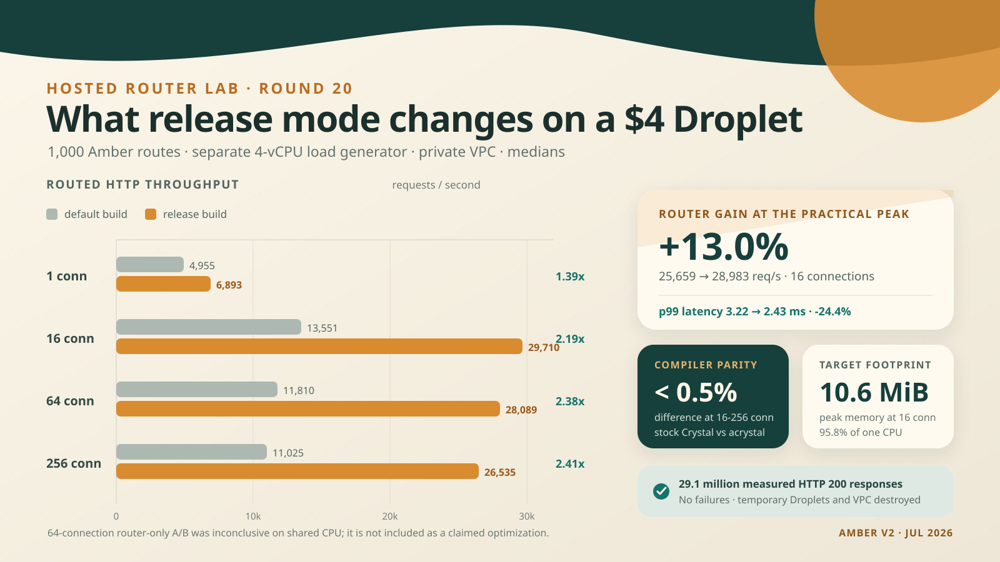

# Amber routing on DigitalOcean, round 20



## Bottom line

This run answers two different questions, and keeping them separate matters.

1. **Should Amber production binaries always use Crystal release mode? Yes.** On the smallest DigitalOcean Droplet, the stock Crystal release binary sustained **29,710 requests/second at 16 connections**, versus **13,551 requests/second without release optimization**. That is **2.19x the throughput, or 119% faster**.
2. **Does the new router still matter after real HTTP parsing and framework dispatch? Yes, at the useful operating point.** In the tighter 16-connection A/B run, the optimized router reached a **28,983 requests/second median**, versus **25,659** for the legacy matcher. That is **13.0% more raw throughput**, **11.9% more requests per consumed CPU-second**, and **24.4% lower p99 latency**.
3. **Does the router result hold at every pressure level? Not defensibly.** At 64 connections, unpaired medians favored the new router by 7.2%, but paired trials favored legacy by 2.3% and only 4 of 9 pairs were wins. The shared-vCPU target was already saturated and occasionally received only 67-71% of a CPU. The 64-connection router-only result is therefore **inconclusive**, not a publishable speedup.
4. **Does this work with both compilers? Yes.** At 16, 64, and 256 connections, stock Crystal and `acrystal` release binaries were within **0.5% throughput** of each other.

Across the two measured matrices, the load generator received **29,090,221 successful HTTP 200 responses** and no failed responses. The benchmark droplets and dedicated VPC were destroyed after the evidence was copied locally.

`2.19x` means 119% faster, not 219% faster. The extra `1.0x` is the original performance.

## Release mode

The five-repetition matrix compared the same stock Crystal source compiled normally and with `--release --no-debug`. It used 10-second measured trials after a 3-second warmup.

| Connections | Default build | Release build | Throughput | Median p50 | Median p99 |
| ---: | ---: | ---: | ---: | ---: | ---: |
| 1 | 4,955/s | 6,893/s | **1.39x, +39.1%** | 187 to 130 us | 417 to 342 us |
| 16 | 13,551/s | 29,710/s | **2.19x, +119.2%** | 1,162 to 500 us | 3,277 to 2,452 us |
| 64 | 11,810/s | 28,089/s | **2.38x, +137.9%** | 5,323 to 2,211 us | 9,860 to 6,206 us |
| 256 | 11,025/s | 26,535/s | **2.41x, +140.7%** | 22,664 to 9,240 us | 40,740 to 19,862 us |

The release binary was also **67.4% smaller**, falling from 8,189,232 bytes to 2,667,960 bytes.

Crystal documents `--release` as `-O3 --single-module`. For this cross-compiled benchmark, `-O3 --no-debug` without `--single-module` and `--release --no-debug` produced byte-identical object files and byte-identical Linux executables. There is no additional runtime win to claim between those two modes for this program; the important boundary is optimized versus the default `-O0` build.

## Router result

The confirmation run held the final framework source, compiler, release flags, route table, requests, and response path constant. The only binary difference was `-Damber_router_legacy_match`. Each A/B pair was kept temporally close, binary and connection order rotated, and every trial ran for 15 seconds after a 5-second warmup.

| Connections | Legacy router | Optimized router | Unpaired median | Paired median | CPU efficiency | p99 | Verdict |
| ---: | ---: | ---: | ---: | ---: | ---: | ---: | --- |
| 16 | 25,659/s | 28,983/s | **+13.0%** | **+14.2%, 7/9 wins** | **+11.9%** | 3,219 to 2,432 us, **-24.4%** | Confirmed at practical peak |
| 64 | 25,147/s | 26,945/s | +7.2% | -2.3%, 4/9 wins | paired -1.1% | 6,650 to 6,426 us, -3.4% | Inconclusive on shared CPU |

Sixteen connections is the useful headline for this target, not a convenient cherry-pick. It produced the highest stable release throughput while using about 96% of the target CPU. Moving to 64 connections did not increase throughput, but multiplied p50 latency by roughly 4.4. At 256 connections, throughput fell further while p50 reached 9.2 ms and peak memory rose to 39.2 MiB. Those points measure queueing and overload behavior rather than additional application capacity.

The hosted result is smaller than the **3.3x to 4.1x matcher-only** gain from round 19 because route matching is only one part of a real request. HTTP parsing, Amber pipeline dispatch, controller setup, parameter access, JSON construction, response serialization, sockets, and kernel scheduling remain after the matcher is accelerated. This is also why the earlier unsafe 55x ceiling was never a valid whole-request claim.

## Compiler compatibility

The same Linux objects were generated with Homebrew Crystal 1.20.3 and `acrystal` 1.20.0-dev `[6636853e8]`, both backed by LLVM 22.1.8 and targeting `x86_64-unknown-linux-gnu` with `x86-64-v2`.

| Connections | Stock Crystal release | `acrystal` release | Fork difference |
| ---: | ---: | ---: | ---: |
| 1 | 6,893/s | 6,454/s | -6.4% |
| 16 | 29,710/s | 29,764/s | +0.2% |
| 64 | 28,089/s | 28,199/s | +0.4% |
| 256 | 26,535/s | 26,651/s | +0.4% |

The one-connection difference is smaller than the run-to-run variation on this shared host and did not persist under load. The saturation results support practical parity: the router and benchmark remain compatible with regular Crystal while retaining fork compatibility.

## What was measured

This was a real network benchmark, but it was deliberately narrower than TechEmpower's complete framework suite.

- **Target:** DigitalOcean Basic `s-1vcpu-512mb-10gb`, the $4/month size, with one shared vCPU and 512 MB advertised memory.
- **Load generator:** DigitalOcean CPU-Optimized `c-4`, four vCPUs and 8 GB memory, running `oha` 1.14.0.
- **Network:** separate hosts in the same private `nyc3` VPC; request traffic used private IPs and did not cross the public internet.
- **Application path:** Crystal `HTTP::Server`, real TCP sockets and HTTP parsing, Amber's pipeline and router, controller construction, path parameter access, JSON body construction for parameterized routes, and HTTP response serialization.
- **Route table:** 1,000 routes representing a mature application.
- **Traffic:** 4,096 deterministic URLs; 45% static, 40% single-parameter, 5% nested, 5% constrained, and 3% glob; 70% hot-set locality; 20% query strings.
- **Validation:** warmup before every trial, process restart for every trial, rotating order, HTTP status validation, systemd CPU and memory accounting, and load-generator CPU/RSS accounting.

The test does **not** include a database, template rendering, TLS, request bodies, application middleware, or a full TechEmpower implementation. It is a realistic router-centered Amber HTTP request, not a claim about every possible Amber endpoint.

At 16 connections, the release server used a median **10.6 MiB peak memory** and about **95.8% of one CPU**. The load generator used a median 108% CPU, roughly 1.08 of its four available cores, so it was not the throughput bottleneck.

## Shared CPU caveat

The smallest Droplet is useful because it is a real low-cost deployment target. It is not controlled benchmark hardware. Its RPS coefficient of variation ranged from about 8% to 20%, and several trials showed the server receiving materially less than one CPU despite being ready to use it.

That variability changes what can be claimed:

- The **2.19x release-mode gain** is much larger than the noise and repeated across every saturated connection level.
- The **16-connection router gain** survived raw medians, paired medians, CPU normalization, and 7 of 9 pairs.
- The **64-connection router gain did not survive paired analysis**, so it is recorded as inconclusive.
- A cross-framework ranking still needs a dedicated-CPU or bare-metal target. This run answers what Amber can do on the actual $4 shared-vCPU Droplet.

## Build and deployment

Heavy Crystal/LLVM code generation happened on the local development machine. The four-vCPU load generator only performed the native Linux link, and the smallest target received finished executables. No compiler or source tree was installed on the target.

The successful pair ran for about 47 minutes at a combined listed rate of $0.13095/hour, approximately **$0.10 of compute**. Including the short failed provisioning attempt, the complete experiment remained approximately **$0.11**. DigitalOcean billing records are the authority for the final charged amount.

The repeatable flow is:

```sh
# Dry-run the exact resources first; APPLY=1 creates them.
benchmarks/digitalocean/provision_router_lab.sh
APPLY=1 benchmarks/digitalocean/provision_router_lab.sh

# Cross-compile Linux objects locally, link on the load generator, and deploy
# only finished binaries to the target.
benchmarks/digitalocean/build_linux_objects.sh
benchmarks/digitalocean/deploy_router_lab.sh

# Full compiler/release/router matrix.
ruby benchmarks/bin/router_digitalocean_ab.rb \
  --inventory=benchmarks/digitalocean/amber-router-r20-inventory.json \
  --binary=stock_default:/opt/amber-router/bin/stock_default \
  --binary=stock_release:/opt/amber-router/bin/stock_release \
  --binary=stock_release_legacy:/opt/amber-router/bin/stock_release_legacy \
  --binary=acrystal_release:/opt/amber-router/bin/acrystal_release \
  --connections=1,16,64,256 --duration=10s --warmup=3s \
  --repetitions=5 --routes=1000 \
  --output=benchmarks/results/round20_digitalocean_release_router_ab.json

# Focused, paired router confirmation.
ruby benchmarks/bin/router_digitalocean_ab.rb \
  --inventory=benchmarks/digitalocean/amber-router-r20-inventory.json \
  --binary=stock_release_legacy:/opt/amber-router/bin/stock_release_legacy \
  --binary=stock_release:/opt/amber-router/bin/stock_release \
  --binary-source-commit=dbca1a97147fb7736adee632af84a7b259cf1006 \
  --connections=16,64 --duration=15s --warmup=5s \
  --repetitions=9 --routes=1000 \
  --output=benchmarks/results/round20_digitalocean_router_confirm_ab.json

# Dry-run the deletion scope first; APPLY=1 destroys the exact lab resources.
benchmarks/digitalocean/destroy_router_lab.sh
APPLY=1 benchmarks/digitalocean/destroy_router_lab.sh
```

The successful lab used dedicated names and tags. Teardown was verified after deletion: only the two unrelated pre-existing Droplets and the two default VPCs remained.

## Evidence

- [`round20_digitalocean_release_router_ab.json`](results/round20_digitalocean_release_router_ab.json): 80-trial release, router, and compiler matrix.
- [`round20_digitalocean_router_confirm_ab.json`](results/round20_digitalocean_router_confirm_ab.json): 36-trial paired router confirmation.
- [`round20_do_objects_manifest.json`](results/round20_do_objects_manifest.json): source commit, compiler versions, target, CPU baseline, object hashes, and sizes.
- [`round20_do_binaries_manifest.json`](results/round20_do_binaries_manifest.json): linked Linux binary hashes, sizes, and dynamic dependencies.
- [`ROUTER_PERFORMANCE_ROUND19.md`](ROUTER_PERFORMANCE_ROUND19.md): local matcher, parsed-HTTP, allocation, and localhost socket evidence.

The honest publishable headline from this hosted run is:

> On DigitalOcean's $4 one-vCPU Droplet, compiling Amber with Crystal release mode more than doubled routed HTTP capacity to about 30,000 requests per second. At the target's practical throughput peak, Amber v2's optimized router added another 13% median throughput and cut p99 latency by 24%, while regular Crystal and the project compiler fork performed equivalently under load.
