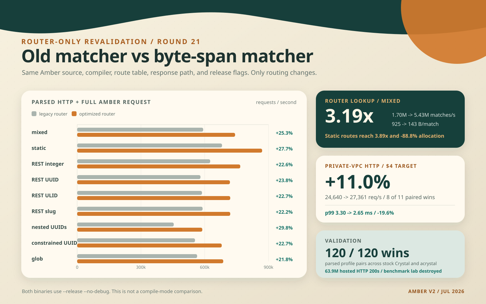

# Amber router-only revalidation, round 21

## Bottom line

This round measures the router change, not Crystal's release flag.

Both hosted binaries came from the same Amber source, stock Crystal 1.20.3, target, linker, and `--release --no-debug` flags. The only intentional difference was `-Damber_router_legacy_match` on the old-router binary.

| Measurement layer | Legacy router | Optimized router | Result |
| --- | ---: | ---: | ---: |
| router lookup only, 1,000 mixed routes | 1.70M/s | 5.43M/s | **3.19x throughput, or 219% faster** |
| parsed HTTP plus full Amber request path | 593,047/s | 743,142/s | **+25.3%** |
| private-VPC HTTP on the smallest Droplet | 24,640/s | 27,361/s | **+11.0%** |

The hosted confirmation also cut median p99 latency from **3.30 ms to 2.65 ms (-19.6%)**, improved CPU-normalized throughput by **5.6%**, and won **8 of 11** temporally paired trials.

The route-shape control is even clearer. Across static routes, integer-like IDs, UUIDs, ULIDs, slugs, action routes, nested parameters, regex constraints, and globs, the optimized router raised parsed-request throughput by **21.0% to 29.8%** and reduced allocation by **25.0% to 35.2%**. It won all **60 of 60** stock-Crystal process comparisons. `acrystal` independently won all **60 of 60** and produced a **20.2% to 29.2%** gain.

`3.19x` means the new matcher performs 3.19 times as much work in the same time. That is 219% faster, not 319% faster. The much larger matcher number becomes a smaller whole-request number because HTTP parsing, pipeline dispatch, controller construction, response building, socket I/O, and kernel scheduling still remain.

This is an isolated Amber v2 router comparison, not an Amber 1.4 versus Amber 2 comparison. The legacy binary keeps the current framework and swaps only the matcher back, which is what lets us attribute the difference to routing.

## What was routed

The fixture contains 1,000 unique GET routes. It is deliberately centered on the 500 to 1,500 route range expected in a mature application rather than a 10,000-route stress case.

| Route kind | Count | Example declaration | What the request exercises |
| --- | ---: | --- | --- |
| static | 450 | `/api/v1/resource_7/search` | literal segment lookup, no path params |
| REST ID | 250 | `/api/v1/rest_resource_7/:id` | one captured trailing parameter |
| dynamic action | 150 | `/api/v1/resource_7/:id/comments` | captured parameter followed by a literal |
| nested | 50 | `/api/v1/resource_7/:id/children/:child_id` | two captured parameters |
| constrained | 50 | `/api/v1/account_7/:id/revision` | anchored integer, UUID, or ULID regex |
| glob | 50 | `/assets/bundle_7/*path` | a captured multi-segment tail |

Every profile uses 4,096 deterministic request URLs, 70% hot-set locality, and query strings on 20% of requests. The mixed profile is 45% static, 25% REST ID, 15% dynamic action, 5% nested, 5% constrained, and 5% glob.

The HTTP benchmarks do real work after matching. Crystal parses keep-alive HTTP/1.1 bytes and headers, Amber dispatches through its pipeline, the controller reads `params["id"]` or the corresponding nested/glob value, JSON is built, and Crystal serializes the response. The hosted test adds real TCP sockets and a separate load generator over DigitalOcean's private VPC.

### What an ID means

An unconstrained `:id` is a string segment. Amber does not inspect it and decide that it is an integer, UUID, ULID, or slug while matching. These four profiles therefore take the same routing branch:

| ID profile | Example | Length / behavior |
| --- | --- | --- |
| integer-like | `10000042` | 8-byte captured string; not converted to an integer |
| UUID | `018f1e2d-3c4b-7a69-8f01-00000000002a` | 36-byte captured string |
| ULID | `01J8Z3M5N70000000000000042` | 26-byte captured string |
| slug | `customer-order-42-spring-catalog` | longer human-readable captured string |

The longer forms cost a little more because more bytes are scanned, captured, copied when the param is consumed, and emitted in JSON. They do not trigger a different lookup algorithm.

The constrained profiles are different. Their route declarations attach anchored regular expressions, so Amber calls the regex engine and rejects the wrong identifier shape. The correctness suite verifies valid and invalid integer, UUID, and ULID inputs for both matcher implementations. This distinction matters because regex work is the clearest remaining routing hotspot.

## Route-shape results

The router-only column measures lookup plus parameter capture. The parsed-request columns include the HTTP parser, full Amber pipeline, controller param access, JSON response construction, and HTTP serialization, but exclude sockets and kernel scheduling.

| Traffic profile | Matcher speedup | Parsed HTTP legacy | Parsed HTTP optimized | Request gain | Allocation change |
| --- | ---: | ---: | ---: | ---: | ---: |
| mixed | 3.19x | 593,047/s | 743,142/s | **+25.3%** | **-29.6%** |
| static | 3.89x | 681,287/s | 869,978/s | **+27.7%** | **-35.2%** |
| REST integer-like ID | 3.19x | 626,176/s | 767,442/s | **+22.6%** | **-25.4%** |
| REST UUID | 3.13x | 580,036/s | 718,163/s | **+23.8%** | **-25.0%** |
| REST ULID | 3.21x | 586,505/s | 719,363/s | **+22.7%** | **-25.2%** |
| REST slug | 3.20x | 589,425/s | 720,500/s | **+22.2%** | **-25.1%** |
| UUID plus action | 3.24x | 564,162/s | 702,457/s | **+24.5%** | **-27.6%** |
| nested UUIDs | 2.71x | 453,799/s | 589,037/s | **+29.8%** | **-25.6%** |
| constrained integer | 2.64x | 596,735/s | 722,052/s | **+21.0%** | **-26.6%** |
| constrained UUID | 2.33x | 554,570/s | 680,421/s | **+22.7%** | **-25.7%** |
| constrained ULID | 2.40x | 542,091/s | 660,850/s | **+21.9%** | **-26.0%** |
| glob | 2.58x | 563,778/s | 686,895/s | **+21.8%** | **-28.0%** |

The static route result directly answers whether known paths have more room. Matcher throughput rises from **2.17M to 8.43M matches/second (3.89x)** while allocation falls from **861 to 96 bytes/match (-88.8%)**. Once the rest of a parsed request is included, the same route improves **27.7%** and saves **797 bytes/request**.

Nested routes have the largest complete-request gain even though their matcher ratio is lower. The old path pays heavily for splitting, collecting candidates, eagerly decoding two params, and allocating a params hash. Removing that work affects a larger share of this request.

## Hosted confirmation

The confirmation used a DigitalOcean Basic `s-1vcpu-512mb-10gb` target and a separate CPU-Optimized four-vCPU load generator. They communicated only over a dedicated private `nyc3` VPC. Each binary/profile trial started a fresh server process, warmed for 5 seconds, measured for 15 seconds at 16 connections, and rotated binary order across 11 repetitions.

| Metric | Legacy router | Optimized router | Change |
| --- | ---: | ---: | ---: |
| throughput | 24,640/s | 27,361/s | **+11.0%** |
| requests per consumed CPU-second | 27,435 | 28,974 | **+5.6%** |
| p50 latency | 553 us | 532 us | **-3.8%** |
| p99 latency | 3.30 ms | 2.65 ms | **-19.6%** |
| peak memory | 10.76 MiB | 10.74 MiB | effectively unchanged |

The paired median was **+8.8%**, with 8 wins in 11 pairs. This is directionally consistent with round 20's independent **+13.0%** router confirmation and the much tighter parsed-request control.

The smallest Droplet is useful real hardware, but its CPU is shared. During the confirmation, individual trials received as little as 77.5% of one core, and throughput coefficient of variation reached 15.0% for the legacy binary. The 11.0% hosted result is a measured result for this run, not a promise that every shared Droplet will reproduce exactly 11.0%.

The larger exploratory hosted matrix ran all 12 successful route profiles for seven pairs each. Optimized medians were higher for 11 of 12 profiles, paired medians favored optimized for all 12, and optimized won 57 of 84 pairs. Because per-profile host noise was sometimes larger than the format difference, the stable parsed-request table above is the right source for comparing integer, UUID, ULID, and slug behavior.

Across the hosted profile matrix and confirmation, the load generator received **63,867,362 HTTP 200 responses** with a 100% success rate.

## What changed inside routing

The old matcher did several pieces of work for every request:

1. Lowercase and concatenate the method with the request path.
2. Split the path into an `Array(String)`, allocating segment strings.
3. Recursively collect every compatible candidate.
4. Decode and copy path parameters eagerly.
5. Sort candidates to recover route insertion priority.

The optimized matcher instead:

1. Normalizes common HTTP methods without concatenating them to the path.
2. Enters the method-specific trie root directly.
3. Scans byte offsets and lengths in the original path rather than splitting it.
4. Uses hash lookup for literal children and small arrays for variable alternatives.
5. Prunes branches that cannot beat the current insertion-priority winner.
6. Stores the source string plus offset and length for captured params, materializing a string only when application code asks for it.

The benchmark does ask for captured IDs and writes them into JSON. The result is therefore not inflated by skipping parameter use.

## Stack and compile-time routing

Putting the 1,000-route table on each request's stack is not a useful optimization. The table must live for the whole process and be shared by concurrent requests; stack storage has the lifetime of one call. Rebuilding or copying it per request would cost far more and a large fixed stack object would increase overflow risk.

Amber's route macros already know route declarations at compile time, but the generated code constructs the route objects and trie once during application startup. Those long-lived objects are not recreated or garbage-collected on every request. The allocation problem was temporary request data, especially split path arrays, segment strings, candidate arrays, eager params, and method/path concatenation. The byte-span matcher removes most of that work.

The compile-time equivalent worth exploring is read-only program data, not stack data: a generated immutable trie, compact transition table, or minimal perfect hash stored with static lifetime. That idea still needs to beat the current hash-and-span trie. A previous macro-generated giant Crystal `case` reached only 1.19M to 1.90M matches/second, versus 6.26M to 6.81M for the span matcher, because hundreds of string comparisons became a linear scan.

The best next experiments supported by this data are:

1. Add typed constraint primitives such as integer, UUID, and ULID that scan the existing byte span directly, while keeping arbitrary regex constraints for full compatibility. This can avoid the substring passed to PCRE2 on common constrained routes.
2. Add typed param readers that parse an integer or identifier directly from the captured span when the controller does not need a `String` object.
3. Prototype a compact generated literal-child dispatch table and reject it unless it improves parsed HTTP, not only a toy lookup loop.

## Compatibility and evidence

The default optimized path and the legacy comparison path remain compatible with both compilers:

| Gate | Stock Crystal 1.20.3 | `acrystal` 1.20.0-dev `[6636853e8]` |
| --- | ---: | ---: |
| complete Amber suite | 2,328 examples, 0 failures | 2,328 examples, 0 failures |
| legacy-flag router suite | 276 examples, 0 failures | 276 examples, 0 failures |
| route-profile equivalence suite | 4 examples, 0 failures | 4 examples, 0 failures |
| parsed HTTP route-shape A/B | 60/60 optimized wins | 60/60 optimized wins |

Both compilers use LLVM 22.1.8 on the benchmark host. The Linux hosted objects were cross-compiled from checkpoint `ec06899`, and the parsed-profile runner is checkpointed at `cd2e0d3`.

Evidence files:

- [`round21_route_shape_stock.json`](results/round21_route_shape_stock.json): matcher throughput and allocation for stock Crystal.
- [`round21_route_shape_acrystal.json`](results/round21_route_shape_acrystal.json): the same matcher matrix with the compiler fork.
- [`round21_http_route_profiles_ab.json`](results/round21_http_route_profiles_ab.json): 120-trial parsed HTTP profile matrix on stock Crystal.
- [`round21_http_route_profiles_acrystal_ab.json`](results/round21_http_route_profiles_acrystal_ab.json): 120-trial parsed HTTP profile matrix on `acrystal`.
- [`round21_digitalocean_router_profiles_ab.json`](results/round21_digitalocean_router_profiles_ab.json): 168-trial hosted route-profile matrix.
- [`round21_digitalocean_router_mixed_confirm_ab.json`](results/round21_digitalocean_router_mixed_confirm_ab.json): 22-trial hosted mixed confirmation.
- [`round21_do_objects_manifest.json`](results/round21_do_objects_manifest.json): compiler, source, flags, object hashes, and comparison invariant.
- [`round21_do_binaries_manifest.json`](results/round21_do_binaries_manifest.json): linked Linux binary hashes and sizes.

The lab existed from 2026-07-17 01:38 UTC until teardown at approximately 02:55 UTC. At listed rates, the target and load generator cost approximately **$0.17** before any account-specific billing treatment. Both benchmark Droplets and the dedicated VPC were destroyed and verified absent. Only unrelated pre-existing resources remained.
