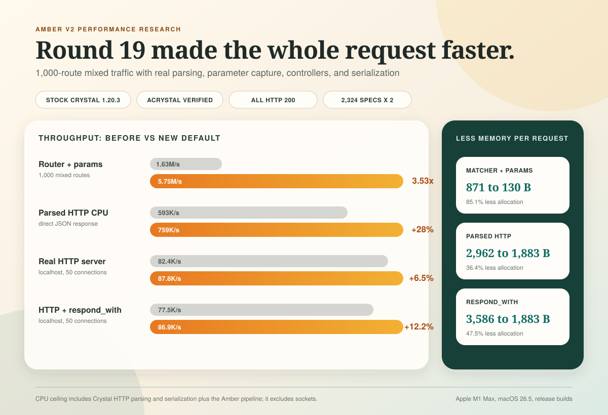

# Amber v2 routing performance, round 19



## Bottom line

This pass produced a real framework improvement, not just a faster toy matcher.

- The new default router is **3.33x to 4.05x faster** than the original matcher across 500, 1,000, and 1,500 mixed routes on stock Crystal and `acrystal`.
- At 1,000 routes with path parameters consumed, stock Crystal improved from **1.63M to 5.75M matches/second**, a **3.53x** result, while allocation fell from **871 to 130 bytes/match**.
- A parsed-HTTP CPU benchmark improved from **593K to 759K requests/second** for direct JSON responses, or **28.1%**, while allocation fell **36.4%**.
- The same parsed-HTTP benchmark through `respond_with` improved from **452K to 728K requests/second**, or **61.3%**, while allocation fell **47.5%**.
- A real Amber server driven through localhost TCP improved **3.2% at one connection** and **6.5% at 50 connections** for direct JSON responses.
- The real server through `respond_with` improved **6.6% at one connection** and **12.2% at 50 connections**. At 50 connections, p99 latency fell **16.8%**.

`1.33x` means 33% faster than the baseline. It does not mean 133% faster. A `4x` result means four times the throughput, or 300% more throughput than the baseline.

We did **not** reproduce a defensible 55x whole-request result. That scale only appears when comparing the old allocating matcher with unsafe or semantically incomplete dispatch ceilings that skip route semantics, parameter capture, and safe result ownership. The publishable claim for mature applications is the 3.33x to 4.05x safe matcher improvement and the measured end-to-end gains above.

## What the benchmark includes

The route set models a mature Amber application rather than tiny or extreme route tables:

- 500, 1,000, and 1,500 routes for matcher tests.
- 1,000 routes for HTTP tests.
- 45% static, 40% single-parameter, 5% nested-parameter, 5% constrained, and 3% glob traffic.
- Matcher traffic also includes 2% not-found requests.
- 70% of requests come from a realistic hot set.
- 20% of successful requests include query strings.
- HTTP requests include `Host`, `Accept`, and `User-Agent` headers.

There are three deliberately separate measurements:

1. **Matcher throughput** isolates route lookup and parameter capture.
2. **Parsed-HTTP CPU throughput** runs Crystal's real HTTP request parser over keep-alive request bytes, then runs Amber routing, pipeline dispatch, controller params, response negotiation when enabled, headers, body serialization, and Crystal's HTTP response serializer. It excludes sockets and kernel scheduling.
3. **Socket throughput** starts a real Amber `HTTP::Server` and drives it with `oha` through localhost TCP. Process order rotates on every repetition, every trial warms up first, and the runner rejects any non-200 response.

The parsed-HTTP test is the best estimate of Amber's user-space request ceiling on this machine. It is not a claim that a deployed service will deliver 759K network requests/second. The socket test is closer to a real request, but a same-host client and server still share CPU and kernel resources. A publishable cross-framework headline needs a separate load generator and dedicated host.

## Results

### Safe matcher, stock Crystal

| Routes | Workload | Original | New default | Speedup | Allocation change |
| ---: | --- | ---: | ---: | ---: | ---: |
| 500 | mixed | 1.81M/s | 6.81M/s | 3.77x | 871 to 111 B, -87.2% |
| 500 | mixed + params | 1.79M/s | 6.32M/s | 3.54x | 871 to 130 B, -85.1% |
| 1,000 | mixed | 1.63M/s | 6.55M/s | 4.01x | 871 to 111 B, -87.2% |
| 1,000 | mixed + params | 1.63M/s | 5.75M/s | 3.53x | 871 to 130 B, -85.1% |
| 1,500 | mixed | 1.72M/s | 6.26M/s | 3.64x | 873 to 111 B, -87.3% |
| 1,500 | mixed + params | 1.70M/s | 5.85M/s | 3.44x | 873 to 130 B, -85.1% |

The same matrix on `acrystal` produced **3.33x to 4.05x** speedups with the same allocation profile. This is important: the optimization does not depend on a fork-only compiler behavior.

### Parsed HTTP CPU ceiling

| Response path | Original | New default | Throughput gain | Bytes/request | Allocation reduction |
| --- | ---: | ---: | ---: | ---: | ---: |
| direct JSON | 592,582/s | 759,005/s | +28.1% | 2,962 to 1,883 | -36.4% |
| `respond_with` JSON | 451,734/s | 728,317/s | +61.3% | 3,586 to 1,883 | -47.5% |
| optional param lookups | 635,279/s | 687,122/s | +8.2% | 2,481 to 2,136 | -13.9% |

The final direct path takes about **1.32 microseconds/request** in this CPU-only setup. The final `respond_with` path takes about **1.37 microseconds/request**. That is a practical lower bound for this exact parser, pipeline, controller, and JSON payload on this Apple M1 Max, not a universal framework floor.

### Real localhost HTTP server

| Response path | Connections | Original | New default | RPS gain | p50 change | p99 change |
| --- | ---: | ---: | ---: | ---: | ---: | ---: |
| direct JSON | 1 | 25,113 | 25,906 | +3.2% | -2.7% | -2.7% |
| direct JSON | 50 | 82,414 | 87,776 | +6.5% | -4.7% | -14.0% |
| `respond_with` JSON | 1 | 24,037 | 25,618 | +6.6% | -5.1% | -4.7% |
| `respond_with` JSON | 50 | 77,480 | 86,915 | +12.2% | -8.8% | -16.8% |

All measured socket responses were HTTP 200. Direct results use seven repetitions of six seconds per connection level. `respond_with` results use five repetitions. The runner rotates baseline/final process order to reduce thermal and scheduling bias.

## What changed

The accepted path is intentionally less clever than several rejected prototypes. It wins by doing less work per request while preserving the existing route contract.

| Checkpoint | Change | Measured reason to keep it |
| --- | --- | --- |
| `6c3d46a` | Match route trails as byte spans instead of allocating split path strings | Core of the 3.33x to 4.05x matcher gain and 85%+ allocation reduction |
| `b9068df` | Enter the method-specific route root directly | Removes method/path concatenation and avoids matching the verb as another segment |
| `74d6294` | Build controller params only when first used | Saved about 143 B/request; socket gain was 0.2% to 1.6% |
| `631e2de` | Remove the second route-validity check | About 0.8% CPU gain and 0.3% to 0.8% socket gain |
| `17d7678` | Allocate validator rules, params, and errors on demand | Saved about 68 B/request; up to about 1% socket gain |
| `a853d23` | Allocate multipart file storage only when needed | Saved about 34 B/request; 0.5% to 1.0% socket gain |
| `3e18c3e` | Skip form, multipart, and JSON body parsers when Content-Type makes them irrelevant | Optional-param workload gained 8.2% CPU and 1.3% to 1.5% socket throughput |
| `a6fa10d` | Replace `respond_with`'s per-request hash and broad negotiation setup with fixed typed slots and exact common-header paths | Isolated socket gain of 2.5% to 6.0%; five-format CPU path gained 11.4% over hash storage |
| `1ff27bc` | Make the byte-span route path the default while retaining a legacy compile flag | Ships the gain without requiring application changes |

`respond_with` remains compile-time aware: unused response formats do not occupy runtime slots, declaration order is retained, and only the selected response block executes. The optimized web path does not remove future native response targets; the macro can still discard formats that are not present in a given build target.

## Ideas we rejected

A useful result of this round is knowing which attractive ideas do not survive a complete request benchmark.

- **Static-route cache:** about 2x faster for static matcher-only traffic, but dynamic routes and misses regressed 6% to 21%. A sampled variant improved the mixed microbenchmark about 18%, then measured effectively neutral in real HTTP: +0.07% at one connection and -0.15% at 50.
- **A giant macro-generated Crystal `case`:** 1.19M to 1.90M matches/second versus 6.26M to 6.81M for the span matcher. Hundreds of linear string comparisons made compile-time generation 3.6x to 5.6x slower at runtime.
- **Method-specialized trie:** about 9.6% faster in matcher isolation, but projected below 1% of a full request and carried a much larger generated-code and maintenance cost.
- **Shared mutable route result:** reached roughly 59M matches/second with zero allocation, but it is unsafe under concurrent fibers and changes result ownership semantics. It is a ceiling probe, not shippable code.
- **Split or subclassed route result objects:** saved allocation for static matches but added it back for parameterized matches; the best version still regressed socket throughput.
- **Caching a route pointer on every HTTP request:** crossed a Crystal object size-class boundary and added about 112 B/request. It was removed.
- **Status-code response fast path:** approximately 1.7% slower in the complete benchmark.
- **Numeric selected-response slots:** approximately 2% slower than the fixed typed slots for multi-format `respond_with`.
- **Duplicate valve lookup removal:** compiler-neutral and not worth changing the code.

This is why the final implementation uses a compact general matcher rather than an enormous generated dispatch function or request-global cache.

## Reproduce it

The original source baseline is `9f43742`. Branch `experiment/router-performance-revalidation-round19-baseline-harness` adds benchmark code only through `785baf4`; it does not contain the production optimizations. The optimized branch is `experiment/router-performance-revalidation-round19` at `1ff27bc` plus this report commit.

Build and run the matcher matrix from the optimized worktree:

```sh
crystal build benchmarks/router_revalidation_micro.cr --release -o /tmp/amber-router-micro
/tmp/amber-router-micro \
  --tiers=500,1000,1500 \
  --operations=5000000 \
  --warmup=500000 \
  --output=benchmarks/results/router_revalidation_micro.json
```

Build the same command with `acrystal` to verify fork compatibility.

Build the parsed-HTTP benchmark in both the baseline-harness and optimized worktrees, then run each binary with identical arguments:

```sh
crystal build benchmarks/router_revalidation_http_cpu.cr --release -o /tmp/amber-router-http-cpu
/tmp/amber-router-http-cpu \
  --routes=1000 \
  --operations=200000 \
  --warmup=20000 \
  --repetitions=9 \
  --output=benchmarks/results/router_revalidation_http_cpu.json
```

Add `-Damber_bench_respond_with` at build time for negotiated responses, or `-Damber_bench_optional_params` for the optional-param workload.

For real TCP, build `benchmarks/router_revalidation_http_server.cr` in each worktree, generate a URL file once with `--url-file`, and compare the two release binaries with:

```sh
ruby benchmarks/bin/router_http_ab.rb \
  --server=original:/tmp/amber-router-original \
  --server=optimized:/tmp/amber-router-optimized \
  --url-file=/tmp/amber-router-urls.txt \
  --connections=1,50 \
  --duration=6s \
  --warmup=2s \
  --repetitions=7 \
  --routes=1000 \
  --output=benchmarks/results/router_http_ab.json
```

The committed evidence is in [`benchmarks/results`](results/). The primary files are:

- [`round19_router_micro_final_stock.json`](results/round19_router_micro_final_stock.json)
- [`round19_router_micro_final_acrystal.json`](results/round19_router_micro_final_acrystal.json)
- [`round19_http_cpu_original_stock.json`](results/round19_http_cpu_original_stock.json)
- [`round19_http_cpu_final_default_stock.json`](results/round19_http_cpu_final_default_stock.json)
- [`round19_http_cpu_respond_original_stock.json`](results/round19_http_cpu_respond_original_stock.json)
- [`round19_http_cpu_respond_final_stock.json`](results/round19_http_cpu_respond_final_stock.json)
- [`round19_http_final_vs_original_ab.json`](results/round19_http_final_vs_original_ab.json)
- [`round19_http_respond_full_stack_ab.json`](results/round19_http_respond_full_stack_ab.json)

## Publication gate

These local results are strong enough to justify the change and shape the public story. Before publishing a cross-framework ranking or absolute RPS headline, repeat the socket test on pinned dedicated hardware with a separate load generator, record CPU governor and thermal state, use at least 10 measured repetitions, and include confidence intervals. Run the existing TechEmpower Crystal subset as a separate test because its JSON benchmark measures more than router speed.

The honest public headline from this machine is:

> Amber v2's new router matches realistic 500 to 1,500 route applications 3.3x to 4.1x faster, cuts matcher allocation by 85%+, and improves measured full HTTP throughput by up to 12% over localhost while reducing tail latency by up to 17%.
