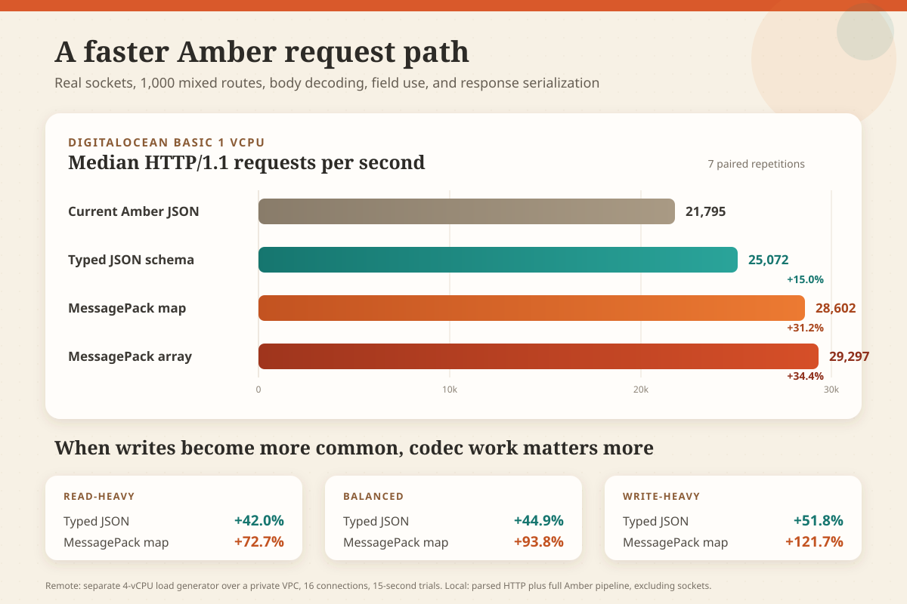

# Engineering Amber's Request Path

## An Evidence-Based Study of Routing, Typed JSON, MessagePack, and HTTP Transport

**Publication status:** Public review draft 0.1

**Research date:** July 17, 2026

**Research checkpoint:** `9e0453b`

**Experiment branch:** [`experiment/framework-performance-protocol-codec-round22`](https://github.com/crimson-knight/amber/tree/experiment/framework-performance-protocol-codec-round22)

**Standalone router branch:** [`experiment/v2-byte-span-router`](https://github.com/crimson-knight/amber-router/tree/experiment/v2-byte-span-router)

## Executive summary

This study asked a practical question: after major router improvements, what prevents Amber V2 from approaching the throughput associated with high-performance Rust, Zig, Go, and C++ web frameworks?

We evaluated four hypotheses:

1. HTTP/1.1 is the primary limitation.
2. Routing remains the dominant framework cost.
3. Amber's generic JSON params pipeline performs avoidable parsing and allocation.
4. Typed binary decoding can materially improve a realistic mixed application.

The evidence rejects the first two as primary explanations and strongly supports the third and fourth.

TechEmpower's JSON benchmark is an HTTP/1.1 benchmark, so native HTTP/2 or HTTP/3 support would not improve Amber's score in that workload. The optimized router remains measurable, but Linux CPU samples place route selection at roughly 4% to 5% of self samples under the tested mixed application. Request-body decoding, temporary object construction, HTTP header representation, allocator activity, socket I/O, and kernel networking now offer more aggregate headroom.

On a DigitalOcean Basic one-vCPU target, a separate CPU-Optimized four-vCPU load generator produced these whole-request medians:

| Request-body strategy | Median RPS | Change from current JSON | p50 | p99 | Paired wins |
| --- | ---: | ---: | ---: | ---: | ---: |
| current Amber JSON params | 21,795 | baseline | 655 us | 4.20 ms | - |
| buffered typed JSON prototype | 25,072 | **+15.0%** | 559 us | 3.31 ms | 7/7 |
| streaming MessagePack map prototype | 28,602 | **+31.2%** | 513 us | 3.14 ms | 7/7 |
| buffered MessagePack array prototype | 29,297 | **+34.4%** | 498 us | 3.12 ms | 7/7 |

The full remote matrix completed 18,728,053 requests without a socket error or non-success response. A focused default-path confirmation completed another 5,033,193 successful requests. The tested body-codec improvements are prototypes, not merged Amber APIs, but they establish a clear investment direction.

Our recommended implementation order is:

1. Productionize compile-time typed JSON decoding and validation while preserving the existing params API.
2. Add an optional, audited MessagePack map codec after resolving implementation provenance and safety limits.
3. Reduce HTTP header and content-type parsing overhead.
4. Introduce bounded reusable request and response buffers.
5. Prototype borrowed-span request parsing, reusable request objects, and coalesced writes in Crystal's HTTP layer.
6. Pursue native HTTP/2 and HTTP/3 as product capabilities, not as substitutes for HTTP/1.1 efficiency.

## 1. Scope and claim boundaries

This paper measures an Amber V2 experiment branch against controlled alternatives built from the same source. It is not an Amber 1.4 versus Amber V2 release comparison, and it is not a direct TechEmpower ranking submission.

The study includes three measurement layers:

| Layer | Included | Excluded | Purpose |
| --- | --- | --- | --- |
| codec microbenchmark | decode, encode, round trip, allocation | HTTP, routing, controller, sockets | establish parser ceilings and wire-size effects |
| parsed full-framework CPU lane | Crystal HTTP parse/serialize, Amber routing and pipeline, body decode, field use, controller response | TCP sockets and kernel scheduling | isolate application CPU and allocation |
| DigitalOcean socket lane | all CPU-lane work plus real TCP, Linux scheduler, private VPC, separate load generator | public internet latency, TLS, database, templates | validate whole-request behavior on hosted hardware |

Results from one layer must not be presented as another. A `3.19x` router matcher result means 3.19 times the matcher throughput, or 219% faster matching. It does not mean a complete application will serve 3.19 times as many requests.

The best remote result in this study is 29.3k RPS on a small shared one-vCPU target. It cannot be compared directly with a 40k to 50k result collected on different hardware, software, connection behavior, or payloads. A fair cross-language claim requires identical binaries, request definitions, network topology, and machine types.

## 2. Research questions

### 2.1 Is HTTP/1.1 the principal limit?

Crystal 1.20.3's standard `HTTP::Server` accepts HTTP/1.0 and HTTP/1.1. It contains ALPN primitives but not a native HTTP/2 framing and HPACK server, and it does not contain an HTTP/3 and QUIC server.

That limits Amber's native protocol feature set, but it does not explain the current leaderboard position. TechEmpower's JSON test uses cleartext HTTP/1.1 keep-alive without pipelining. Its plaintext test uses HTTP/1.1 with 16-request pipelining. The-benchmarker also exercises HTTP/1.1 behavior.

HTTP/2 and HTTP/3 can improve real application behavior through multiplexing, compressed headers, reduced connection count, and better loss recovery. Those features do not remove routing, validation, body decoding, allocation, serialization, or application work. They should be measured as separate transport products.

### 2.2 Does routing remain dominant?

The byte-span router from the preceding experiment changed the complete cost structure. At 1,000 mixed routes it improved matcher throughput from 1.70 million to 5.43 million matches per second, a 3.19x ratio. In a parsed full-request lane the same change improved throughput by 25.3%. On the smallest DigitalOcean target it improved throughput by 11.0% and reduced p99 latency by 19.6%.

In this study's Linux profiles, optimized route selection accounted for 3.72% of legacy-JSON self samples and 4.92% of MessagePack-map self samples. Its share rises after body decoding gets faster, but it is no longer the dominant area.

### 2.3 Does Amber's JSON params path perform avoidable work?

Yes. The current path:

1. Reads the complete request body into a `String`.
2. Parses a generic `JSON::Any` tree.
3. Materializes a params hash.
4. Converts non-string values back into JSON strings.
5. Reparses nested values when typed access requests them.

That sequence provides a flexible compatibility API but duplicates parsing and creates temporary strings, tree nodes, and hash entries.

The typed prototype buffers once and decodes directly into a compile-time-known payload. On the hosted target that raised whole-request throughput by 15.0%. In local controls it improved throughput by 42.0% to 51.8%, depending on write frequency, and reduced allocation by 29.0% to 36.9%.

### 2.4 Does MessagePack create a meaningful framework gain?

Yes, as an optional typed codec. MessagePack map improved the hosted result by 31.2% and MessagePack array by 34.4%. Their local advantage grew as body-bearing writes became more common.

The result does not justify replacing JSON by default. JSON has broad interoperability, debuggability, browser support, and existing Amber compatibility. MessagePack should be negotiated explicitly for clients that benefit from smaller payloads and typed binary decode.

## 3. Workload design

### 3.1 Installed route table

The fixture installs 1,000 unique routes, centered on the scale expected from a mature business application rather than a 10,000-route stress case.

| Route shape | Installed | Share | Example work |
| --- | ---: | ---: | --- |
| static | 450 | 45% | literal path lookup |
| REST ID | 250 | 25% | one captured integer-like, UUID, ULID, or slug ID |
| ID plus action | 150 | 15% | captured ID followed by a literal segment |
| nested params | 50 | 5% | two captured identifiers |
| constrained | 50 | 5% | integer, UUID, or ULID regex constraint |
| glob | 50 | 5% | captured multi-segment tail |

The route declarations contain 400 GET, 300 POST, 153 PUT, 100 PATCH, and 47 DELETE handlers.

### 3.2 Repeated traffic table

Every variant receives the same deterministic 4,096-request sequence. The SHA-256 of the request table is `8543042f1684cf2a42ca7759a4166c171af6aaf22678aa88dee7eab407cbe0f5`.

| Method | Sampled requests | Share |
| --- | ---: | ---: |
| GET | 2,665 | 65% |
| POST | 820 | 20% |
| PUT | 328 | 8% |
| PATCH | 203 | 5% |
| DELETE | 80 | 2% |

The sample preserves the installed route-shape distribution: 1,844 static, 1,024 REST, 613 variable-action, and 205 each nested, constrained, and glob requests.

Seventy percent of requests select the first 20% within each method-and-route-shape cell. This simulates hot endpoints without turning the benchmark into a global static-route hot set. Twenty percent include query strings.

### 3.3 Body and response behavior

Writes carry eight fields representative of a mobile or CRUD API: strings, an integer, a floating-point value, a boolean, and a string collection. Controllers consume every field and emit a serialized acknowledgement. Reads consume route parameters and serialize a response.

| Representation | Wire bytes | Change from JSON |
| --- | ---: | ---: |
| JSON | 257 | baseline |
| MessagePack map | 222 | -13.6% |
| MessagePack array | 159 | -38.1% |

The MessagePack map keeps field names and supports practical schema evolution. The array removes field names and depends on a versioned positional contract.

## 4. Experimental infrastructure

### 4.1 Local controls

Homebrew Crystal 1.20.3 and `acrystal` 1.20.0-dev `[6636853e8]` both use LLVM 22.1.8 on the benchmark host. Local binaries run repeated warmup and measurement loops and report median throughput, nanoseconds per request, allocated bytes per request, and response bytes.

### 4.2 Hosted lane

The hosted lab used:

- target: DigitalOcean Basic `s-1vcpu-512mb-10gb`, 480 MB visible RAM;
- load generator: DigitalOcean CPU-Optimized `c-4`;
- network: dedicated private `10.141.0.0/20` VPC in `nyc3`;
- load: four `wrk` threads and 16 persistent connections;
- trial: five-second warmup followed by 15 seconds of measurement;
- schedule: seven paired repetitions with rotating variant order;
- build: release-mode `x86_64-v2` objects cross-compiled locally and linked on Linux.

The load generator and target were separate so client work could not consume the target's one vCPU. Every trial started a fresh server process. The runner captured throughput, p50, p99, server CPU accounting, memory peak, socket errors, response status, binary hash, workload hash, and hardware metadata.

The dedicated lab existed for about 47 minutes and cost approximately $0.10 at listed rates. Both Droplets and the VPC were destroyed. A fresh query in the `agentc` context confirmed that no tagged Amber benchmark Droplets or dedicated VPC remained.

## 5. Results

### 5.1 Hosted whole-request results

| Variant | Median RPS | RPS per CPU-second | p50 | p99 | Peak memory |
| --- | ---: | ---: | ---: | ---: | ---: |
| stock current JSON | 21,795 | 22,827 | 655 us | 4.20 ms | 10.30 MiB |
| stock default cleanup | 21,607 | 22,652 | 654 us | 4.15 ms | 10.64 MiB |
| stock typed JSON | 25,072 | 25,966 | 559 us | 3.31 ms | 10.46 MiB |
| stock MessagePack map | 28,602 | 29,336 | 513 us | 3.14 ms | 11.02 MiB |
| stock MessagePack array | 29,297 | 29,986 | 498 us | 3.12 ms | 10.62 MiB |
| `acrystal` default JSON | 24,445 | 24,852 | 591 us | 3.20 ms | 11.67 MiB |
| `acrystal` MessagePack map | 28,410 | 29,574 | 508 us | 2.93 ms | 10.94 MiB |

Typed JSON, MessagePack map, and MessagePack array beat the current stock path in all seven paired trials. Compiler behavior was not a universal multiplier: the fork's JSON result was higher in this run, while its MessagePack map result was nearly tied with stock Crystal.

The default header and POST-method cleanups are allocation hygiene, not a throughput claim. A tighter 11-pair run measured a +0.8% paired median RPS ratio, +0.5% requests per CPU-second, and seven wins. That is compatible with a neutral effect on shared cloud hardware.

### 5.2 Local full-framework throughput

| Traffic profile | Current JSON | Typed JSON | MessagePack map | MessagePack array |
| --- | ---: | ---: | ---: | ---: |
| read-heavy | 309,480/s | 439,461/s (**+42.0%**) | 534,501/s (**+72.7%**) | 575,985/s (**+86.1%**) |
| balanced | 245,763/s | 356,068/s (**+44.9%**) | 476,314/s (**+93.8%**) | 498,707/s (**+102.9%**) |
| write-heavy | 196,974/s | 299,043/s (**+51.8%**) | 436,687/s (**+121.7%**) | 448,288/s (**+127.6%**) |

### 5.3 Local allocation

| Traffic profile | Current JSON | Typed JSON | MessagePack map | MessagePack array |
| --- | ---: | ---: | ---: | ---: |
| read-heavy | 4,776 B/request | 3,392 B (-29.0%) | 2,569 B (-46.2%) | 2,664 B (-44.2%) |
| balanced | 6,650 B/request | 4,377 B (-34.2%) | 3,003 B (-54.8%) | 3,162 B (-52.5%) |
| write-heavy | 8,354 B/request | 5,272 B (-36.9%) | 3,399 B (-59.3%) | 3,615 B (-56.7%) |

The MessagePack map path allocates less than the array path in the whole framework despite the array's smaller wire representation. The map implementation streams typed fields, while the fastest array variant first buffers the body. This is an implementation detail worth revisiting, not a property of the format itself.

### 5.4 Codec ceilings

| Decode strategy | Operations/second | ns/op | Bytes allocated/op |
| --- | ---: | ---: | ---: |
| current Amber JSON params | 378,644 | 2,641 | 5,328 |
| typed JSON | 649,881 | 1,539 | 1,744 |
| MessagePack map | 2,514,440 | 398 | 928 |
| MessagePack array | 3,930,213 | 254 | 672 |
| specialized typed map subset | 3,780,540 | 265 | 496 |

The specialized map subset demonstrates that compile-time field dispatch can approach positional array performance while retaining names. It is not a complete MessagePack decoder and must not be used for untrusted production input.

## 6. A useful failed experiment

Direct typed JSON parsing from `HTTP::FixedLengthContent` was expected to beat buffered typed JSON by avoiding a body copy. It produced only 250,203/s in the read-heavy lane, below the current JSON path at 309,480/s and far below buffered typed JSON at 439,461/s.

The likely cause is repeated checked and virtual `IO` access. For this bounded 257-byte body, one allocation and contiguous parse are cheaper than many abstract stream reads.

This changes the implementation recommendation. The default fast path should enforce a body limit, obtain one contiguous buffer, and perform one typed parse. A future borrowed-buffer HTTP parser could remove that copy without reintroducing per-byte virtual calls.

## 7. CPU profile findings

Linux `perf` collected 14,501 current-JSON samples and 14,207 MessagePack-map samples with zero lost samples. The profiled server sustained 23.3k and 27.2k RPS respectively.

| Self-sampled area | Current JSON | MessagePack map | Interpretation |
| --- | ---: | ---: | --- |
| virtual NIC transmit | 6.74% | 7.76% | application improvements expose more kernel/network share |
| soft IRQ handling | 3.90% | 4.58% | packet work is material on one vCPU |
| optimized route selection | 3.72% | 4.92% | routing remains measurable but not dominant |
| `GC_malloc_kind` | 3.31% | 2.80% | fewer allocations reduce direct allocator pressure |
| secondary libgc allocation path | 2.47% | 1.70% | MessagePack removes temporary object work |
| JSON string and token lexing | at least 1.13% | absent | typed binary decoding removes visible lexer work |
| header hash lookup and parsing | at least 2.9% | at least 2.5% | generic header representation is a credible next target |

Self-sample percentages are not additive end-to-end timings. A function can also appear below another sampled stack. They identify candidates for controlled replacement; they do not guarantee the same percentage as a resulting throughput gain.

## 8. MessagePack product decision

MessagePack is suitable as an optional Amber codec, not as a universal JSON replacement.

The registered media type is `application/vnd.msgpack`. Public APIs should prefer map objects because named fields allow additive schema evolution. Compact arrays should require an explicit versioned contract and are best suited to first-party mobile, desktop, embedded, or service-to-service clients.

The benchmark pins `crystal-community/msgpack-crystal` 1.3.5. Its unchanged upstream suite passes 594 examples under both tested compilers. Production adoption is blocked by two concerns:

1. Repository metadata says MIT while the README says Apache 2.0, and no root license file resolves the conflict.
2. The implementation does not provide complete modern MessagePack timestamp-extension behavior.

Amber should obtain upstream clarification, maintain an audited fork, or build a complete implementation. A production decoder requires limits and tests for:

- total body bytes;
- string and binary bytes;
- array and map element counts;
- nesting depth;
- extension payload size;
- duplicate and unknown map keys;
- integer and floating-point overflow;
- invalid UTF-8 and malformed input;
- truncated input and trailing bytes;
- timestamp extension interoperability;
- fuzzing and denial-of-service behavior.

The specialized benchmark parser satisfies none of those complete-format obligations and should remain benchmark-only.

## 9. Memory management strategy

Stopping the garbage collector for a request is not a safe default optimization. Crystal fibers can share a thread, application objects can escape through logs and callbacks, and Boehm GC does not expose a cheap per-request generation that Amber can reset independently.

The safer low-level strategy is:

- immutable route and schema metadata with process lifetime;
- one bounded request-body buffer per active execution context;
- reusable response scratch buffers with explicit reset;
- borrowed byte spans whose lifetime cannot outlive the request;
- typed field readers that avoid intermediate strings;
- allocation counters and escape tests in the benchmark gate;
- fallback allocation when a request exceeds a safe pool class.

This retains memory safety and compatibility while attacking the same allocation and collection pressure.

## 10. Recommended implementation roadmap

### Phase 1: typed JSON as the compatibility-first fast path

Generate decoder and validation logic from the schema DSL at compile time. Decode a bounded contiguous body directly into typed fields. Preserve current `params` behavior for controllers that require its flexibility.

Acceptance gates:

- all current schema types and validation messages remain compatible;
- unknown, missing, duplicate, nested, nullable, and malformed fields have explicit behavior;
- Homebrew Crystal and `acrystal` pass the complete Amber suite;
- read-heavy remote throughput improves at least 10% with no p99 regression;
- allocation improves at least 20% for body-bearing requests.

### Phase 2: optional MessagePack map codec

Add content negotiation and schema-generated map decoding only after licensing and complete-format safety are resolved. Keep JSON as the default.

Acceptance gates:

- full format and timestamp interoperability fixtures;
- body, depth, collection, string, binary, and extension limits;
- malformed-input corpus and fuzzing;
- JSON and MessagePack schema-equivalence tests;
- at least 20% whole-request remote gain on body-bearing traffic;
- no silent numeric truncation or duplicate-key ambiguity.

### Phase 3: HTTP representation and I/O

Prototype common-header specialization, cached content-type parsing, borrowed request spans, reusable request objects, and coalesced response writes. This likely requires coordinated Crystal stdlib or fork work.

Acceptance gates:

- byte-for-byte behavior compatibility for HTTP/1.0 and HTTP/1.1 edge cases;
- request smuggling and malformed-header security suites;
- fewer allocations and syscalls per request;
- whole-request improvement under both keep-alive and fresh-connection traffic;
- no benchmark-only APIs in the public framework surface.

### Phase 4: transport expansion

Offer documented reverse-proxy HTTP/2 and HTTP/3 first. Evaluate a native server only when protocol compliance, TLS, flow control, backpressure, graceful shutdown, observability, and maintenance ownership are funded.

Native protocol work should be measured on real WAN-like latency and loss, not only loopback RPS.

## 11. Threats to validity

### Shared target CPU

The Basic target uses a shared vCPU. Individual trials received different CPU availability. Pair rotation and CPU-normalized throughput reduce, but do not eliminate, noisy-neighbor effects. Codec candidates won every pair, while the small default cleanup did not produce a reliable throughput claim.

### Small request body

The 257-byte JSON payload represents common API traffic, not uploads or very large documents. Larger bodies can change copy, cache, and streaming tradeoffs. Separate size classes are needed before choosing universal buffer thresholds.

### No database or template renderer

The fixture intentionally isolates framework request work. A database-bound application will see a smaller end-to-end percentage. The optimization still increases framework capacity and reduces CPU cost, but it cannot remove external latency.

### HTTP without TLS

The private-VPC lane uses cleartext HTTP/1.1 to match the core leaderboard question and isolate server work. TLS termination, certificate choice, and encryption change CPU and latency. They require a separate proxy-versus-native experiment.

### One concurrency point

The confirmatory lane uses 16 connections because it saturates the one-vCPU target without overwhelming the load generator. A release gate should include low concurrency, saturation, and overload curves rather than one maximum-throughput point.

### Prototype implementation maturity

Typed JSON and MessagePack paths are benchmark prototypes. Their performance supports investment; it does not prove production API completeness, security, or maintainability.

## 12. Compatibility and reproducibility

| Verification gate | Homebrew Crystal 1.20.3 | `acrystal` 1.20.0-dev |
| --- | ---: | ---: |
| complete Amber suite | 2,338 examples, 0 failures | 2,338 examples, 0 failures |
| targeted request/context specs | 58 examples, 0 failures | 58 examples, 0 failures |
| upstream MessagePack suite | 594 examples, 0 failures | 594 examples, 0 failures |

The branch stores:

- benchmark source and pinned dependency lock;
- deterministic route and traffic generation;
- local stock and fork results;
- hosted raw results and aggregate metadata;
- Linux CPU profile reports;
- cross-compile object hashes and exact link commands;
- final Linux binary hashes and dependencies;
- DigitalOcean provision, deploy, run, and destroy scripts;
- a plain-language technical report and performance visualization.

Primary evidence:

- [Standalone router extraction and benchmark](https://github.com/crimson-knight/amber-router/tree/experiment/v2-byte-span-router)
- [Standalone router results](https://github.com/crimson-knight/amber-router/blob/experiment/v2-byte-span-router/benchmarks/RESULTS.md)
- [Round 22 technical report](../../benchmarks/DIGITALOCEAN_FRAMEWORK_ROUND22.md)
- [Hosted 49-trial matrix](../../benchmarks/results/round22_digitalocean_framework_workload.json)
- [Focused default-path confirmation](../../benchmarks/results/round22_digitalocean_default_cleanup_confirm.json)
- [Stock codec results](../../benchmarks/results/round22_codec_stock.json)
- [`acrystal` codec results](../../benchmarks/results/round22_codec_acrystal.json)
- [Cross-compile provenance](../../benchmarks/results/round22_do_objects_manifest.json)
- [Deployed binary provenance](../../benchmarks/results/round22_do_binaries_manifest.json)
- [Current JSON CPU profile](../../benchmarks/results/round22_stock_json_legacy_perf.txt)
- [MessagePack CPU profile](../../benchmarks/results/round22_stock_msgpack_map_perf.txt)

## 13. Conclusion

Amber's next major performance opportunity is not a protocol label or a single router trick. It is a more precise request-data pipeline.

The optimized router already removed a large amount of path splitting, candidate collection, eager parameter materialization, and allocation. That success changed what matters next. Compile-time typed JSON provides a meaningful gain without changing client formats. MessagePack provides a larger optional gain for controlled clients. After those changes, HTTP header representation, bounded buffer reuse, response write coalescing, and Crystal's request parser become the credible path toward another major step.

The hosted prototype improved a realistic mixed Amber request path by 34.4% on the same small target. Reaching 40k RPS on that exact target would require another 36.5%. The profile does not guarantee that result, but it identifies work substantial enough to test.

The central conclusion is therefore not that Amber has already reached Rust-level performance. It is that Amber now has a reproducible, evidence-driven program for closing the gap without sacrificing compatibility or making benchmark-only changes to application behavior.

## References

1. [Crystal 1.20.3 `HTTP::Server`](https://crystal-lang.org/api/1.20.3/HTTP/Server.html)
2. [Crystal HTTP version parser](https://github.com/crystal-lang/crystal/blob/1.20.3/src/http/common.cr#L21)
3. [TechEmpower R23 HTTP/1.1 JSON workload](https://github.com/TechEmpower/FrameworkBenchmarks/blob/R23/toolset/wrk/concurrency.sh)
4. [TechEmpower R23 pipelined plaintext workload](https://github.com/TechEmpower/FrameworkBenchmarks/blob/R23/toolset/wrk/pipeline.sh)
5. [HTTP/2, RFC 9113](https://www.rfc-editor.org/rfc/rfc9113.html)
6. [HTTP/3, RFC 9114](https://www.rfc-editor.org/rfc/rfc9114.html)
7. [MessagePack format specification](https://github.com/msgpack/msgpack/blob/master/spec.md)
8. [IANA MessagePack media type registration](https://www.iana.org/assignments/media-types/application/vnd.msgpack)
9. [`crystal-community/msgpack-crystal`](https://github.com/crystal-community/msgpack-crystal)
